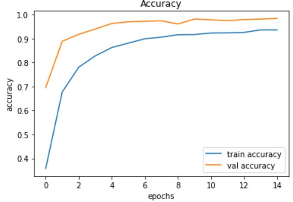

# Traffic-Sign-Detection
https://traffic-sign-recognition.herokuapp.com/

#### Accuracy: around 94%

#### Framework:
Keras integrated in TensorFlow 2.2.0

#### Dataset:
[GTSRB - German Traffic Sign Recognition Benchmark](https://www.kaggle.com/meowmeowmeowmeowmeow/gtsrb-german-traffic-sign) hosted on Kaggle. It has a total of 39,209 images for training, stored in 43 subfolders. Each training image is 3 channel (RGB) of size 30x30. For testing, there are 12,631 images.

#### Model architecture

#### Model accuracy

